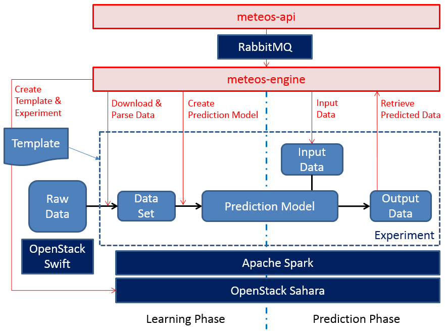

Meteos Architecture
===================

Meteos is Machine Learning as a Service (MLaaS) in Apache Spark. Meteos create
a workspace of Machine Learning via sahara spark plugin and manage some
resources and jobs regarding Machine Learning.

Meteos components
~~~~~~~~~~~~~~~~~

Meteos consist of meteos-api service and meteos-engine service.

* meteos-api - web service which has REST interface.
* meteos-engine - service which manage Meteos resources.

Resources
~~~~~~~~~

Meteos manages these resources regarding machine learning.

* Experiment Template - Template which define experiment like number of
  master/worker nodes, spark version, base VM image, flavor, network, etc.
* Experiment - a workspace of Machine Learning.
* Data Set - a data parsed by user to create a Prediction Model.
* Prediction Model - a model produced by data mining and machine learning
  algorithms.
* Learning Job - a job which consists of input data, output data(predicted
  data), job status, job stdout/stderr.

The following diagram illustrates the architecture of mistral:

